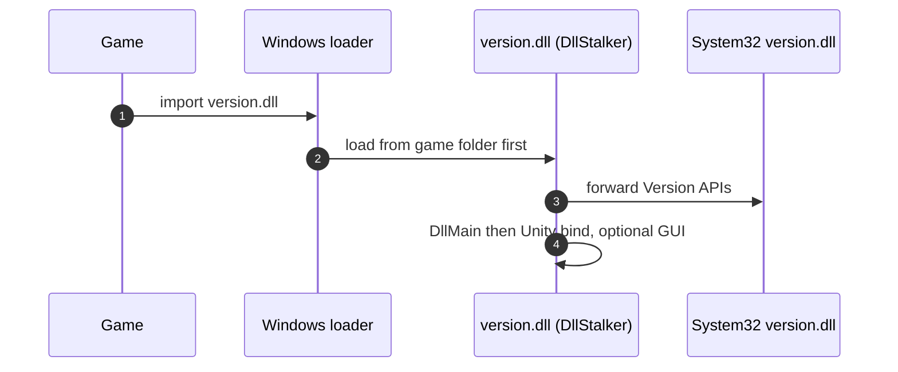

# DllStalker

   

A `version.dll` proxy for inspecting and modifying Unity games at runtime. GUI-enabled builds add reflection tools, live editing, value search, hooks and Lua scripting; Release provides a lightweight hook-only payload.


## Why `version.dll`?

Windows loads DLLs from the game folder before System32. Unity (and other native code) already import the system Version APIs. Dropping DllStalker under that name makes the process load **us** first. We forward those exports to `C:\Windows\System32\version.dll`, so version checks keep working while our `DllMain` runs.




## Deploy

1. Copy the DLL next to the game `.exe`.
  1. Take the **DebugRelease|x64** build from [Artifacts](https://github.com/OttoTre/DllStalker-public/releases) or compile it yourself locally (see **Build configs**).
2. Keep the filename exactly `version.dll`.
3. Launch the game.
  1. The Control Panel is included in **DebugRelease** and **Debug**.
4. Built-in plugins (C++ presets) run first. By default no preset is selected — see [Creating a new preset](#creating-a-new-preset).
5. (Optional) If the Control Panel is enabled:
  1. It opens as a separate desktop window, not an in-game overlay.
  2. Click **Init Dumper Engine**. The **System log** on that screen is bootstrap output only; it is not shown after init.
  3. Closing the control panel does not quit the game.

Runtime files live next to the proxy under `stalker_runtime/` (`mods/` for scripts, `session/` for bookmark and watch recipes). **Release** also writes `stalker_runtime/dllstalker.log`.

## Build configs


| Visual Studio config | Control panel       | Bootstrap log            |
| -------------------- | ------------------- | ------------------------ |
| DebugRelease        | x64 (daily driver) | Yes (optimized dumper)   |
| Debug               | x64                | Yes (native stepping)    |
| Release             | x64                | No (hooks / engine only) |


Visual Studio with the Desktop development with C++ workload is required to build.

## Creating a new preset

C++ hook bundles live under `src/presets/`. Each `.cpp` self-registers; add the file to `DllStalker.vcxproj`. This is separate from Lua packages in `stalker_runtime/mods`.

1. Add `src/presets/<name>/<name>.cpp`.
2. Implement `Install(void* assemblyImage)`, hook with `HOOK_FUNCTION`, register with `Presets::Register` (no central `switch`).
3. In `src/services/hook_installer.cpp`, set `kSelectedPresetName` to that preset’s name (case-sensitive). Use `"-"` for **no** preset hooks (avoids colliding with GUI call-logger hooks).
4. Rebuild and deploy `version.dll`. Confirm install lines on the Init **System log** (or Release `stalker_runtime/dllstalker.log`).

```cpp
#include "pch.h"
#include "presets/hook_preset.h"
#include "services/hook_installer.h"
#include "unity_resolver.h"

namespace
{
using _TargetMethod = void(__fastcall*)(void* __this);
_TargetMethod oTargetMethod = nullptr;

void __fastcall hkTargetMethod(void* __this) {
    oTargetMethod(__this);
}

void Install(void* assemblyImage) {
    HOOK_FUNCTION(
        Engine::Unity.GetMethodAddress(assemblyImage, "SomeClass", "TargetMethod"),
        hkTargetMethod,
        oTargetMethod);
}

const Presets::HookPreset kPreset = { "Example", "Assembly-CSharp", &Install };
const bool kRegistered = (Presets::Register(kPreset), true);
}
```

In-tree presets are examples, not a supported-game list. There is no runtime picker.

## Control panel

### Session

Saved bookmarks and watches are stored under `stalker_runtime/session/` as names and field paths, not memory addresses.

When restoring a bookmark in a later game session, DllStalker resolves the saved root class, selects the **first** live instance and follows the saved field path. If several instances of that class exist, the restored bookmark may point to a different object than before.

In a later game session, static watches reconnect automatically. Instance watches remain stale and must be added again after selecting the desired object.

### Search

By default **Deep** is toggled on. It searches inside Array/List elements and follows pointer fields up to depth 2.

Enter a field name and/or value, then click **Search**. Editing the query or toggling Deep does not start a scan.

### Scripting

The **Scripting** dock runs LuaJIT packages from `stalker_runtime/mods` next to the proxy.

- Drop a folder (`main.lua`; optional `manifest.json`) or a loose `.lua` file (Safe one-shot).
- Default profile is **Safe**. Request Curated with `"profile": "Curated"` in the manifest. Curated exposes typed helpers / C ABI on the proxy DLL; see the Scripting Guide. There is no unrestricted FFI profile.
- There is no in-app editor: edit files on disk, then Refresh, select the package and Start / Stop / Reload. Output goes to the dock console.

| File | Purpose |
|------|---------|
| [`docs/examples/README.md`](docs/examples/README.md) | Script packages: getting started and links |
| [`docs/examples/Scripting-Guide.md`](docs/examples/Scripting-Guide.md) | Lua API, profiles, Curated ABI |
| [`docs/examples/Manifest-Schema.md`](docs/examples/Manifest-Schema.md) | Manifest fields and defaults |

## ⚠️ Important Disclaimer & Legal Notice

**This project is intended for educational, research and authorized local development use only.**

### 1. No Anti-Cheat Bypasses

It is a user-mode tool and does **not** include kernel drivers, anti-cheat bypasses, signature cloaking or thread-hiding mechanisms.

Do not use it with anti-cheat-protected online games. DLL injection may be detected and can result in account restrictions or permanent bans. When testing your own game, use an authorized offline build with its anti-cheat components disabled.

### 2. Stability & Memory Safety

It reads and modifies runtime memory through native IL2CPP/Mono pointers. Invalid method calls, field writes or stale pointers may cause access violations, game crashes or corrupted saves.

Use it at your own risk and keep backups of important data. The authors are not responsible for data loss, account restrictions or damage caused by its use.

### 3. Intended Use

The tool is designed for inspecting object structures and runtime behavior in controlled, offline or otherwise authorized environments. It does not modify game binaries on disk or distribute protected game assets, and it is not intended for manipulating online matches.


