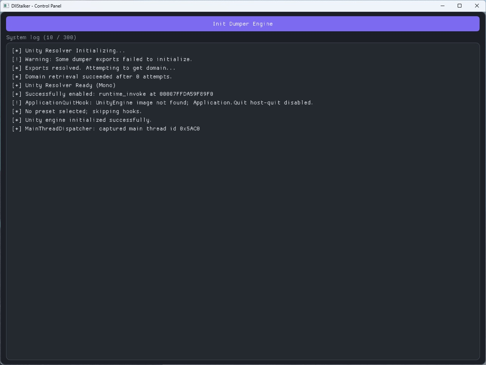

# DllStalker

DllStalker is a C++20 internal DLL toolkit for Unity games (IL2CPP and Mono). It combines runtime API resolution, preset-based hook installation and optional debug tooling (GUI + console) for reverse-engineering workflows.



## Core Goals

- Resolve Unity runtime APIs dynamically (`il2cpp_*` / `mono_*`)
- Reduce hardcoded offsets by resolving methods/fields at runtime
- Install hooks through a self-registering preset system
- Provide an optional debug workflow for live inspection and testing

## Main Components

- **UnityResolver** (`include/unity_resolver.h`, `src/unity_resolver.cpp` → `include/engine/`, `src/engine/`)
  - Detects backend (`GameAssembly.dll` / `mono-2.0-bdwgc.dll`)
  - Resolves runtime exports dynamically
  - Exposes image/class/method/field lookup helpers

- **UnityDumper** (`include/unity_dumper.h`, `src/unity_dumper.cpp` → `include/dumper/`, `src/dumper/`)
  - Catalogs, field/method invocation, collection views, SDK export (`ENABLE_DUMPER` only)

- **Hook Services** (`include/services/`, `src/services/`)
  - MinHook installation helpers (`Hooks::`)
  - Preset selection and installation entry point
  - Main-thread dispatch bridge for safe managed invokes (debug tooling path)

- **Types** (`include/types/`, `src/types/`)
  - POD structs, `memory_guard`, value decode/write, type classification

- **Presets** (`include/presets/`, `src/presets/`)
  - Each preset lives in its own `.cpp` and self-registers
  - Installer chooses one preset name and applies all hooks from that preset

- **GUI** (`include/gui/`, `src/gui/`)
  - Win32 + D3D11 + Dear ImGui control panel
  - Runtime metadata browsing, field analysis, transform edit, live watch/plot, call logging, SDK export dock

## Build Notes

`ENABLE_DUMPER` in `include/pch.h` is defined when `_DEBUG` or `DEBUGRELEASE`. It gates the GUI, dumper and related `types/` code.

| Config | Dumper GUI |
| --- | --- |
| **DebugRelease \| x64** | Yes — optimized; preferred daily driver |
| **Debug \| x64** | Yes — full GUI + native stepping/breakpoints |
| **Release \| x64** | No — hooks and engine only |

### Release (production hook payload)

Use **Release \| x64** for a lean DLL focused on preset hooks.

- Optimized code generation
- Smaller/faster runtime footprint
- No GUI or dumper paths
- Best choice for stable, repeatable hook deployment

### Debug (development and investigation)

Use **Debug \| x64** when you need the control panel plus native debugging.

- Full GUI and runtime invoke tooling
- Console output for live feedback
- Easier iteration on hooks and inspector behavior

### DebugRelease (recommended for GUI work)

Use **DebugRelease \| x64** when smoke-testing the control panel.

- Optimized like Release, with all `ENABLE_DUMPER` paths enabled
- Typical build for inspector, dock tabs, transform tab and call logger validation

## Binary Placement

Build output: **version.dll**.

### Deploy

1. Copy `version.dll` to the game root folder (same folder as the game `.exe`).
2. Keep the filename exactly `version.dll`.
3. Run the game and verify startup logs.

### Why `version.dll`?

Windows checks the game executable folder first for imported DLLs.
Placing `version.dll` next to the game `.exe` makes the game load DllStalker at startup.

## Debug Console

When the bootstrap thread initializes successfully, DllStalker allocates a console window and writes runtime logs to stdout.

Typical console usage includes:

- Startup status (`Unity.Init`, preset install progress)
- Hook creation/enable results and error codes
- Runtime warnings (missing exports, unresolved targets)
- Live operational logs from active hooks

Why this matters:

- Fast validation that hooks were mounted
- Immediate signal when a method/assembly lookup fails
- Easier triage of Debug vs Release behavior differences

## GUI Capabilities

The debug GUI is for runtime exploration, controlled edits and safe invocation.

**First step:** click **Init Dumper Engine** in the control panel before browsing assemblies.

**Layout:** left metadata browser (~30%); right workspace (**Methods | Fields | Transform**); bottom **Utilities Dock** (**Bookmarks → History → Watcher → Logger → Exporter**). Dock tabs restore navigation or host live tooling; they do not replace the main inspector models.

### Utilities Dock

| Tab | Purpose |
| --- | --- |
| **Bookmarks** | Saved inspector locations; restore with shared navigation validation |
| **History** | Navigation timeline and audit rows (read-only; distinct from call log) |
| **Watcher** | Live field watchlist; inner **Watchlist** / **Charts** for numeric plots |
| **Logger** | Inner **Hooks** / **Log**; native call hooks and rolling args-only call log |
| **Exporter** | Export field offsets (optional methods/enums) to C++ `.h` or C# `.cs` beside the injected DLL |

From **Watcher** or **History**, **Jump** restores the workspace to the linked location.

### Browser and filtering

- **Image Selection**
  - Shows loaded assemblies/images with class counts
  - Filter is **case-sensitive** (`strstr` behavior)
- **Class Browser**
  - Fuzzy filter over class name + namespace
  - Filter is **case-insensitive**
- **Sorting behavior**
  - Data is rendered from runtime snapshots/caches
  - For Mono image enumeration, duplicates are normalized internally (sorted + deduplicated before display)

### Instance discovery (two methods)

In the **Fields** tab, **Find Instances** supports two discovery modes:

1. **Static discovery** — scans static-instance candidates
2. **Live API** — uses Unity live object lookup APIs

Switch source mode, run discovery and pick the active instance from the candidates combo.

### Field analysis and watch

On the **Fields** tab (analysis toolbar):

- **Snapshot** baseline → **Show changes** tints rows when values drift (green/red/yellow).
- **Compare two instances** — class-level A vs B from root instance finds; **Current path** mode for drilled paths and collection element index.
- **`[W]`** — add/remove a field on the **Watcher** dock tab (live reads; plottable numerics can open **Charts**).
- **`[T]`** — focus **Transform** on a Transform/GameObject pointer field.
- **Enum fields** — decoded literals; editable via combo when supported.

### Methods tab (Run and Log)

**Run** flow (invoke from GUI):

The **Run** button is available when prerequisites are met:

- main-thread dispatcher hook is active,
- main thread is captured,
- method signature is supported,
- an instance is selected for instance methods.

For zero-argument methods, execution is immediate. For methods with arguments, the invoke modal is used.

**Log** (call logger):

- Toggle **Log** on supported methods (`*` when active) to install a native MinHook detour (cap **16** hooks).
- Lines appear in **Utilities → Logger → Log** as `[HH:MM:SS] Class::Method(arg: val, …)` (register args only; no return suffix).
- Manage hooks on **Logger → Hooks**; **Clear log** on the **Log** subtab only.
- Eligibility matches the invoke path where possible: known signature, primitive/string/pointer params, ≤3 instance args or ≤4 static register args. Mono methods with unknown params stay disabled.

### Transform tab

Inspect and edit Transform/GameObject state via Unity API invokers (not raw offset reads):

- **Sources** — Self, implicit transform/gameObject and field pointers
- **Live** — periodic refetch; **Edit lock** — pause live refresh while editing
- **Fetch / apply** — main-thread getters/setters for local/world position, rotation, scale, activeSelf
- Requires the same main-thread capture as **Run** on Methods

### Field editing

Simple field editing is supported for primitive categories (numeric + boolean) and enums (combo).

- Typical workflow: edit value in-place, press **OK**, auto-refresh verifies the write.
- String/reference/container direct overwrite is intentionally restricted in this path.

### Navigation (Breadcrumbs)

Navigate object graphs directly from field values:

- **Pointer fields** — drill into referenced object
- **Array/List fields** — open synthesized collection view (vector-like navigation)
- **Breadcrumbs** — jump back to any previous level

## Quick Workflows

### Workflow 1: Image → Class → Instance → Run method

1. Click **Init Dumper Engine**.
2. Open **Image Selection** and choose the target image.
3. Use **Class Browser** filter to find your class.
4. In **Fields**, click **Find Instances** and choose source mode (Static discovery / Live API).
5. Pick an instance from the candidates combo.
6. Go to **Methods** and click **Run**:
   - immediate call for 0-arg methods,
   - arg modal for methods with parameters.

### Workflow 2: Edit a primitive field and verify

1. Select image, class and active instance.
2. In **Fields**, edit a primitive or enum value.
3. Click **OK**.
4. Use **Refresh Fields** (or auto-refresh) to confirm the new value.

### Workflow 3: Drill into pointers/collections and return via breadcrumbs

1. In **Fields**, click a pointer value to open nested object view.
2. Click array/list value to open collection view.
3. Continue drilling as needed.
4. Use **Breadcrumbs** to jump back to any previous level.

### Workflow 4: Watch and plot a numeric field

1. Select image, class and instance; open **Fields**.
2. Toggle **`[W]`** on a numeric field.
3. Open **Utilities → Watcher** for live values; use **Plot** on plottable rows to switch to **Charts**.

### Workflow 5: Log native method calls

1. Open **Methods** for the target class.
2. Click **Log** on a supported method (disabled rows show a tooltip why).
3. Trigger the method in-game; open **Utilities → Logger → Log** to tail lines.
4. Use **Hooks** to **Remove** hooks or toggle **Log** off on Methods; **Clear log** clears lines only.

### Workflow 6: Edit transform via Transform tab

1. Select image, class and instance.
2. Open **Transform** or press **`[T]`** on a Transform/GameObject field in **Fields**.
3. Select a source, wait for fetch (main thread must be captured).
4. Edit values and apply; use **Live** for periodic refresh.

### Workflow 7: Export SDK offsets

1. Browse to the desired scope (active class, entire image or bookmarked classes).
2. Open **Utilities → Exporter**.
3. Choose format (C++ or C#), options and filename; export.
4. Output is written next to the injected `version.dll`.

## Creating a New Preset (Example)

Presets self-register at static init: add a new `.cpp` under `src/presets/` and list it in `DllStalker.vcxproj`.

### 1) Create file

Example path:

- `src/presets/example/example.cpp`

### 2) Implement hooks + install function

Minimal shape:

```cpp
#include "pch.h"
#include "presets/hook_preset.h"
#include "services/hook_installer.h"
#include "unity_resolver.h"

namespace
{
using _TargetMethod = void(__fastcall*)(void* __this);
_TargetMethod oTargetMethod = nullptr;

void __fastcall hkTargetMethod(void* __this) {
    // custom behavior
    oTargetMethod(__this);
}

void Install(void* assemblyImage) {
    HOOK_FUNCTION(
        Engine::Unity.GetMethodAddress(assemblyImage, "SomeClass", "TargetMethod", 0, "SomeNamespace"),
        hkTargetMethod,
        oTargetMethod
    );
}

const Presets::HookPreset kPreset = { "Example", "Assembly-CSharp", &Install };
const bool kRegistered = (Presets::Register(kPreset), true); // <---- Function call
}
```

### 3) Select it in installer

In `src/services/hook_installer.cpp`, set:

- `kSelectedPresetName = "Example";` — install that preset's hooks
- `kSelectedPresetName = "-";` — **no preset hooks** (default; avoids colliding with GUI call-logger hooks)

### 4) Build and verify

- Build **DebugRelease \| x64** or **Debug \| x64** for console logs + GUI
- Build **Release \| x64** for hook-only payload
- Deploy `version.dll` and confirm preset install messages in the console

## Runtime Flow

1. `DllMain` starts bootstrap thread (and GUI thread when dumper is enabled).
2. `Engine::Unity.Init()` resolves runtime exports.
3. Console is allocated for runtime logs.
4. `MainThreadDispatcher::InstallRuntimeInvokeHook()` (dumper builds) — non-fatal if it fails.
5. `Hooks::StartHooking()` initializes MinHook and installs the selected preset.
6. GUI thread runs the control panel; user clicks **Init Dumper Engine** to create `UnityDumper` and load images.

## Repository Layout (high level)

```text
DllStalker/
├── include/
│   ├── engine/
│   ├── dumper/
│   ├── gui/
│   │   ├── app/
│   │   ├── infra/
│   │   ├── state/
│   │   │   ├── core/
│   │   │   ├── navigation/
│   │   │   ├── history/
│   │   │   ├── fields/
│   │   │   ├── runtime/
│   │   │   └── transform/
│   │   └── views/
│   │       ├── fields/
│   │       ├── transform/
│   │       └── dock/
│   ├── presets/
│   ├── services/
│   └── types/
└── src/
    ├── engine/
    ├── dumper/
    ├── gui/
    │   ├── app/
    │   ├── infra/
    │   ├── state/
    │   │   ├── core/
    │   │   ├── navigation/
    │   │   ├── history/
    │   │   ├── fields/
    │   │   ├── runtime/
    │   │   └── transform/
    │   └── views/
    │       ├── fields/
    │       ├── transform/
    │       └── dock/
    ├── presets/
    ├── services/
    └── types/
```

## Troubleshooting

### "Preset not found"

- Check `kSelectedPresetName` in `src/services/hook_installer.cpp` (must match a registered name, not `"-"`)
- Ensure the preset `.cpp` is in `DllStalker.vcxproj` and calls `Presets::Register(...)`

### "Failed to find target assembly"

- Verify the preset assembly name (`Assembly-CSharp`, etc.)
- Confirm target runtime is fully initialized before install

### Hook create/enable failed

- Check console output for MinHook status
- Verify method signature/namespace/arg count used in `GetMethodAddress(...)`
- Re-check Debug vs Release behavior for target function layout differences

### Methods tab: Run button disabled

Common causes shown by tooltip/status:

- runtime invoke hook unavailable
- main thread not captured yet
- no active instance for instance method
- unsupported parameter types in current invoke path
- missing method handle/signature

### Class filter works, image filter does not match

This is expected behavior:

- class filter is **case-insensitive**
- image filter is **case-sensitive**

### Logger: Log disabled or no lines

- **Log** disabled: no native address, unknown Mono params, unsupported arg types or too many register arguments.
- **No lines:** hook not armed, method not called yet or hook removed; check **Logger → Hooks**.
- **Cap / install errors:** max **16** hooks; duplicate native target or MinHook install failure shows a status toast.

## ⚠️ Important Disclaimer & Legal Notice

**This project is strictly for educational, research and local development debugging purposes.**

### 1. No Anti-Cheat Bypasses

This tool is a standard user-mode utility. It **does not** contain any kernel-mode bypasses, driver exploits, signature cloaking or thread-hiding mechanisms.

* Running or injecting this tool into games protected by modern kernel-level anti-cheats (such as **Easy Anti-Cheat, BattlEye, Ricochet, Vanguard or similar**) **WILL result in an immediate, automated and permanent ban.**
* If you are a game developer testing your own project with this tool, you **must disable your game's anti-cheat modules** in your compilation configuration before attaching it.

### 2. Stability & Memory Safety Disclaimer

Because this tool performs direct memory queries and interacts natively with runtime objects (IL2CPP/Mono) via pointers:

* Invoking methods or modifying unaligned fields can cause immediate process instability, memory access violations or fatal game crashes.
* Use this tool entirely at your own risk. The author(s) are not responsible for lost game data, corrupted saves or account restrictions.

### 3. Fair Use & Purpose

This tool does not modify game binaries on disk, distribute protected assets or facilitate online matchmaking manipulation. It is designed to help developers and security researchers analyze object structures and runtime behavior in controlled, offline or authorized testing environments.
